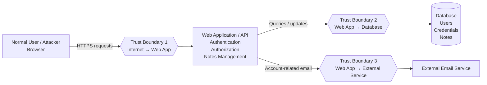

# Task 1 — Threat Model and Secure Configuration

**Track:** Cyber Security  
**Level:** Beginner-friendly  
**Task:** Threat Model and Secure Configuration

> **Note:** The supplied task asks for a threat model of a small web application but does not specify a particular application. For this completed example, the modeled application is a **small User Account & Notes Web Application**. This application choice and the detailed architecture below are assumptions made to complete the exercise.

---

## 1. Objective

The objective is to identify realistic security risks in a small web application and create a prioritized hardening plan.

The task requires:
- A diagram showing users, data, trust boundaries, and external dependencies.
- A list of likely threats using STRIDE or a comparable method.
- Risk ranking using likelihood and impact.
- A prioritized hardening checklist.
- One viewable project containing the work.

---

# 2. Application Being Threat-Modeled

## Example application: User Account & Notes Web Application

The application allows users to:

1. Create an account.
2. Log in.
3. Create and view personal notes.
4. Edit or delete their notes.
5. Log out.

### Main components

| Component | Purpose |
|---|---|
| User/Browser | User interacts with the application |
| Web Application/API | Processes requests, authentication, authorization, and note operations |
| Database | Stores user accounts and notes |
| Email Service | External dependency used for account-related emails |
| Internet | Untrusted network through which users reach the application |

---

# 3. Important Assets

An **asset** is something that should be protected.

| Asset | Why it matters |
|---|---|
| User credentials | Prevent account takeover |
| Session/authentication information | Prevent unauthorized access |
| Personal notes | Protect user privacy and data integrity |
| User profile information | Protect personal information |
| Database | Protect stored application data |
| Application availability | Users should be able to access the service |
| Application configuration/secrets | Prevent unauthorized access to services |

---

# 4. Users and External Dependencies

## Users

### Normal user
A registered user who logs in and manages their own notes.

### Attacker
An unauthorized person who attempts to access another user's information, impersonate a user, modify data, or disrupt the application.

## External dependency

### Email service
The application may use an external email provider for account-related messages.

Because the email service is outside the application's control, it is treated as an external dependency.

---

# 5. Trust Boundaries

A **trust boundary** is a point where data moves between components with different levels of trust.

### Trust Boundary 1 — User/Internet → Web Application

The application receives requests from users over the Internet. Input from users must therefore be considered untrusted.

### Trust Boundary 2 — Web Application → Database

The application communicates with the database. Database credentials and queries must be protected.

### Trust Boundary 3 — Web Application → External Email Service

The application sends information to an external service. API credentials and transmitted information must be protected.

---

# 6. Threat Model Diagram

The following diagram shows users, data stores, trust boundaries, and the external dependency.



### Diagram explanation

1. The user accesses the application through a browser.
2. Traffic crosses Trust Boundary 1 before reaching the web application.
3. The web application authenticates users and performs authorization checks.
4. The application reads and writes user data in the database.
5. The application may communicate with an external email service.
6. The database and external service are separated from the application by their own trust boundaries.

---

# 7. Data Flow Summary

| Data Flow | Source | Destination | Security concern |
|---|---|---|---|
| F1 | Browser | Web App | Untrusted user input |
| F2 | Web App | Database | Unauthorized queries/access |
| F3 | Database | Web App | Sensitive stored information |
| F4 | Web App | Email Service | API credentials and user information |
| F5 | Web App | Browser | Session/authentication information and application data |

---

# 8. STRIDE Threat Analysis

STRIDE is used to organize likely threats.

STRIDE means:

- **S — Spoofing**
- **T — Tampering**
- **R — Repudiation**
- **I — Information Disclosure**
- **D — Denial of Service**
- **E — Elevation of Privilege**

---

## 8.1 Spoofing

### Threat
An attacker may try to log in as another user by obtaining or guessing their credentials.

### Example abuse case
An attacker obtains a user's password and uses it to access the account.

### Possible impact
- Unauthorized account access
- Access to private notes
- Unauthorized changes to account data

### Controls
- Password hashing
- Strong password policy
- Rate limiting on login attempts
- Multi-factor authentication where appropriate
- Secure session management

---

## 8.2 Tampering

### Threat
An attacker may attempt to modify another user's notes or manipulate application data.

### Example abuse case
A user changes an object or note ID in a request and attempts to edit someone else's note.

### Possible impact
- Unauthorized modification of data
- Loss of data integrity

### Controls
- Server-side authorization checks
- Validate ownership of every requested object
- Input validation
- Parameterized database queries
- Audit logging for important changes

---

## 8.3 Repudiation

### Threat
A user may deny performing a sensitive action because the application does not keep sufficient logs.

### Example abuse case
A note is deleted, but there is no record of who deleted it or when.

### Possible impact
- Difficult investigation
- Weak accountability
- Difficulty identifying malicious activity

### Controls
- Log important security events
- Record timestamp and relevant account identifier
- Protect logs from unauthorized modification
- Avoid storing unnecessary sensitive information in logs

---

## 8.4 Information Disclosure

### Threat
Private notes, credentials, or account information may be exposed.

### Example abuse cases
- One user accesses another user's note.
- Sensitive data is sent over an insecure connection.
- Database credentials are accidentally exposed.
- Error messages reveal internal information.

### Possible impact
- Loss of confidentiality
- Privacy violation
- Account compromise

### Controls
- HTTPS/TLS
- Server-side authorization
- Password hashing
- Secure secret management
- Safe error messages
- Database access controls

---

## 8.5 Denial of Service

### Threat
An attacker may send excessive requests and consume application resources.

### Example abuse case
An attacker repeatedly sends login or API requests at high volume.

### Possible impact
- Slow application
- Service unavailable to legitimate users

### Controls
- Rate limiting
- Request size limits
- Resource limits
- Monitoring and alerting
- Infrastructure-level protections where appropriate

---

## 8.6 Elevation of Privilege

### Threat
A normal user may attempt to gain permissions belonging to an administrator or another privileged account.

### Example abuse case
A user modifies a role value in a request and attempts to access administrative functionality.

### Possible impact
- Unauthorized administrative actions
- Access to other users' information
- Application-wide compromise

### Controls
- Server-side role checks
- Deny-by-default authorization
- Never trust client-side role information
- Separate administrative functions
- Test authorization for every sensitive endpoint

---

# 9. Risk Register

## Risk Rating Method

Likelihood and impact are each rated from **1 to 5**.

### Likelihood

| Score | Meaning |
|---|---|
| 1 | Rare |
| 2 | Unlikely |
| 3 | Possible |
| 4 | Likely |
| 5 | Very likely |

### Impact

| Score | Meaning |
|---|---|
| 1 | Very low |
| 2 | Low |
| 3 | Moderate |
| 4 | High |
| 5 | Very high |

### Risk Score

**Risk Score = Likelihood × Impact**

| Score | Priority |
|---|---|
| 1–4 | Low |
| 5–9 | Medium |
| 10–16 | High |
| 17–25 | Critical |

---

# 10. Prioritized Risk Register

| ID | STRIDE | Threat | Likelihood | Impact | Score | Priority |
|---|---|---|---:|---:|---:|---|
| R1 | I | Unauthorized access to another user's notes | 4 | 5 | 20 | Critical |
| R2 | S | Account takeover through stolen/weak credentials | 4 | 5 | 20 | Critical |
| R3 | E | Normal user gains privileged/admin access | 3 | 5 | 15 | High |
| R4 | T | Unauthorized modification of application data | 4 | 4 | 16 | High |
| R5 | I | Sensitive information exposed through errors or insecure communication | 3 | 5 | 15 | High |
| R6 | D | Excessive requests make the service unavailable | 3 | 4 | 12 | High |
| R7 | R | Insufficient logs prevent investigation | 3 | 3 | 9 | Medium |
| R8 | I | Secrets/API credentials exposed | 2 | 5 | 10 | High |

> These numerical ratings are part of this example threat model, not values specified by the supplied task sheet.

---

# 11. Abuse Cases

## Abuse Case 1 — Access another user's note

**Attacker goal:** Read private information.

**Possible approach:**
1. Log in as a normal user.
2. Identify a note identifier.
3. Change the identifier in a request.
4. Attempt to retrieve another user's note.

**Required defense:**
- Check that the authenticated user owns the requested note.
- Perform authorization on the server.
- Do not rely only on hidden UI controls.

---

## Abuse Case 2 — Steal an account

**Attacker goal:** Gain access to another user's account.

**Possible approach:**
1. Obtain or guess a password.
2. Repeatedly attempt login.
3. Use valid credentials to access the account.

**Required defense:**
- Password hashing.
- Login rate limiting.
- Strong authentication controls.
- Secure session handling.

---

## Abuse Case 3 — Gain administrative privileges

**Attacker goal:** Become an administrator.

**Possible approach:**
1. Log in as a normal user.
2. Modify a role or permission value in a request.
3. Attempt to access administrative functionality.

**Required defense:**
- Check authorization on the server.
- Store roles securely.
- Never trust role information supplied by the browser.

---

## Abuse Case 4 — Overload the application

**Attacker goal:** Make the service unavailable.

**Possible approach:**
1. Send many requests.
2. Consume server resources.
3. Prevent normal users from using the service.

**Required defense:**
- Rate limiting.
- Request limits.
- Monitoring.
- Resource controls.

---

# 12. Prioritized Hardening Plan

## Priority 1 — Protect authentication

### Actions
- Hash passwords using a suitable password-hashing mechanism.
- Never store plaintext passwords.
- Apply reasonable password requirements.
- Rate-limit login attempts.
- Use secure session cookies.
- Expire sessions appropriately.

### Verification
- Confirm the database does not contain plaintext passwords.
- Test repeated failed login attempts.
- Inspect session cookie security settings.

---

# 13. Priority 2 — Enforce Server-Side Authorization

### Actions
- Check the authenticated user for every protected operation.
- Verify ownership before reading, modifying, or deleting a note.
- Protect administrative endpoints with server-side role checks.
- Use deny-by-default access control.

### Verification
Test cases should include:

- User A cannot read User B's note.
- User A cannot edit User B's note.
- User A cannot delete User B's note.
- Normal users cannot access administrator-only functions.

---

# 14. Priority 3 — Protect Data in Transit

### Actions
- Use HTTPS/TLS.
- Redirect insecure HTTP traffic where appropriate.
- Secure authentication/session information.
- Avoid sending sensitive information unnecessarily.

### Verification
- Access the application through HTTPS.
- Check that sensitive traffic is not transmitted over plain HTTP.

---

# 15. Priority 4 — Protect Database Access

### Actions
- Use parameterized queries.
- Validate input.
- Give the application only the database permissions it needs.
- Protect database credentials.
- Do not expose the database directly to the Internet.

### Verification
- Review database connection permissions.
- Test input validation.
- Confirm credentials are stored outside source code.

---

# 16. Priority 5 — Protect Secrets

### Actions
Do not place:
- Database passwords
- API keys
- Email service credentials
- Other private secrets

directly in source code or public repositories.

Use environment variables or an appropriate secret-management mechanism.

### Verification
- Search the repository for accidentally committed secrets.
- Check configuration files.
- Rotate a secret if it has been exposed.

---

# 17. Priority 6 — Logging and Monitoring

### Actions
Log important security events such as:
- Successful/failed authentication events.
- Important account changes.
- Sensitive administrative actions.
- Important data modifications.

### Verification
- Trigger a test login failure.
- Trigger a test data modification.
- Confirm the event is recorded.
- Ensure logs do not unnecessarily contain passwords or secrets.

---

# 18. Priority 7 — Rate Limiting and Availability

### Actions
Apply rate limits to sensitive/high-volume endpoints such as:
- Login
- Account recovery
- API requests
- Other resource-intensive operations

### Verification
- Send repeated requests in a controlled test.
- Confirm the application limits excessive requests.
- Verify legitimate requests continue to work normally.

---

# 19. Final Hardening Checklist

| # | Security control | Priority | Verification | Status |
|---|---|---|---|---|
| 1 | Passwords are securely hashed | Critical | Inspect authentication/database implementation | ☐ |
| 2 | Login attempts are rate-limited | Critical | Perform repeated failed-login test | ☐ |
| 3 | Server-side authorization is implemented | Critical | Test access between two users | ☐ |
| 4 | Users can access only their own notes | Critical | Attempt cross-user access | ☐ |
| 5 | Admin functions require server-side authorization | High | Test normal-user access | ☐ |
| 6 | HTTPS/TLS is enabled | High | Check application URL and traffic | ☐ |
| 7 | Parameterized database queries are used | High | Review database code | ☐ |
| 8 | Secrets are not stored in source code | High | Search repository/configuration | ☐ |
| 9 | Security events are logged | Medium | Perform test security events | ☐ |
| 10 | Logs do not expose sensitive secrets | Medium | Review generated logs | ☐ |
| 11 | Request/resource limits are implemented | High | Perform controlled request-volume test | ☐ |
| 12 | Database is not directly exposed to the Internet | High | Review network configuration | ☐ |

---

# 20. Risk-to-Control Mapping

| Risk | Main control |
|---|---|
| Unauthorized note access | Object-level authorization |
| Account takeover | Secure password storage + rate limiting + secure sessions |
| Privilege escalation | Server-side role/permission checks |
| Data tampering | Authorization + input validation + parameterized queries |
| Information disclosure | HTTPS + access controls + safe errors |
| Denial of service | Rate limiting + resource controls |
| Repudiation | Security logging |
| Exposed secrets | Environment/secret management |

---

# 21. Security Testing Plan

The following checks can be performed before considering the application hardened.

### Authentication tests
- Try a valid login.
- Try an invalid password.
- Try repeated failed logins.
- Check session behavior after logout.

### Authorization tests
- Create two test users.
- Create a note under User A.
- Attempt to access it as User B.
- Attempt to edit it as User B.
- Attempt to delete it as User B.

### Privilege tests
- Log in as a normal user.
- Attempt to access administrative functionality.
- Confirm the server rejects unauthorized requests.

### Input tests
- Submit unexpected or invalid input.
- Confirm the application validates input safely.
- Confirm database queries use parameterization.

### Secret-management tests
- Check source code and configuration.
- Confirm API keys and passwords are not committed publicly.

### Availability tests
- Perform controlled repeated requests.
- Confirm rate limits and resource controls work.

---

# 22. Residual Risk

Even after hardening, some risk remains.

Examples include:
- Newly discovered application vulnerabilities.
- Compromised user accounts.
- Vulnerabilities in external services.
- Configuration mistakes.
- Availability problems caused by infrastructure failures.

Therefore, security should be treated as an ongoing process rather than a one-time activity.

---

# 23. Final Prioritized Action List

## Critical
1. Enforce server-side authorization for every protected object.
2. Protect user authentication and passwords.
3. Prevent users from accessing other users' data.
4. Protect sessions and authentication information.

## High
5. Enforce HTTPS/TLS.
6. Protect database access.
7. Protect API keys and application secrets.
8. Prevent privilege escalation.
9. Implement rate limiting.
10. Validate input and use parameterized database queries.

## Medium
11. Implement useful security logging.
12. Review logs for sensitive information.
13. Regularly review permissions and configuration.

---

# 24. Conclusion

This threat model identifies the main assets, users, trust boundaries, data flows, and external dependency of the example web application. STRIDE was used to organize threats into spoofing, tampering, repudiation, information disclosure, denial of service, and elevation of privilege.

The risk register prioritizes unauthorized access, account compromise, privilege escalation, data tampering, information disclosure, and denial-of-service risks. The hardening plan then maps these risks to practical defensive controls and verification steps.

The most important security principle for this application is that **security decisions must be enforced on the server**, especially authentication, authorization, and access to user-owned data.

---

# 25. Submission Structure

For a GitHub repository, the project can be organized as:

```text
cyber-security-task-1/
│
├── README.md
├── threat-model.md
├── risk-register.md
├── hardening-checklist.md
└── diagrams/
    └── threat-model-diagram.md
```

The main `README.md` should contain:
- Task title
- Objective
- Threat-model diagram
- STRIDE analysis
- Risk register
- Hardening checklist
- Verification/testing plan

The final submission should be **one public or view-only link**, as required by the supplied task instructions.
